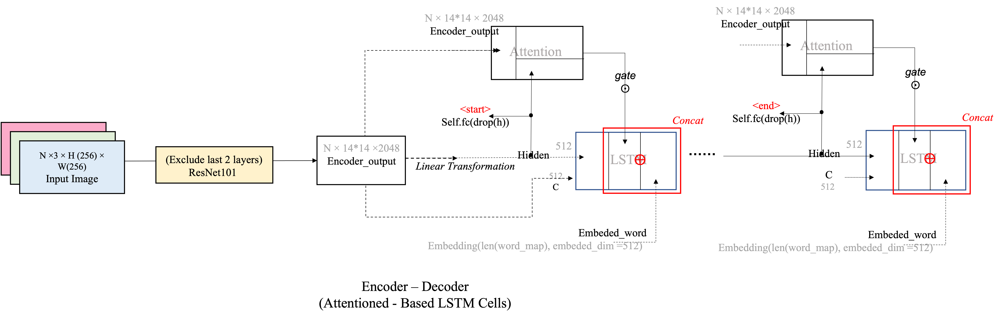
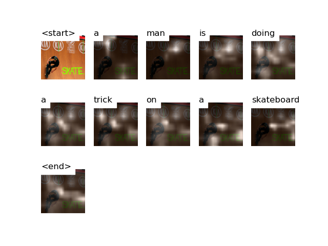
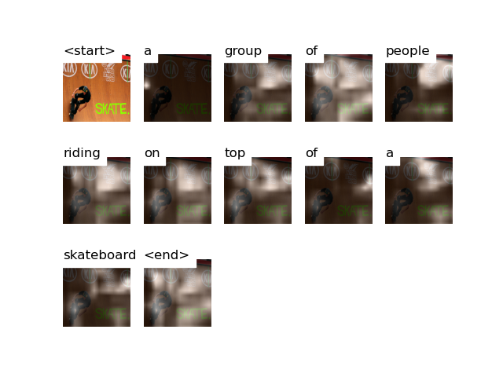
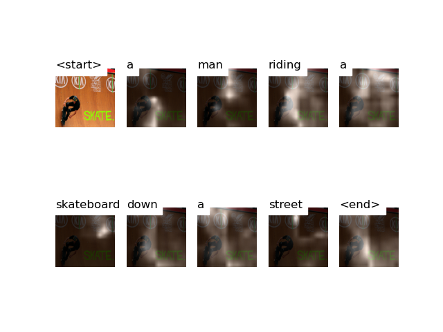

# Image Captioning: ***MSCOCO2014*** dataset
## Dataset info
We used [Andrej Karpathy's .json file containing attributes of training, validation, and test splits (right click link to save)](http://cs.stanford.edu/people/karpathy/deepimagesent/caption_datasets.zip)
The original dataset contains 113287 images; For raining/testing convenience, we used first 50,000 images, among which:
- Training: 40,000 instances have split arrtibute in {'TRAIN', 'RESTVAL'}
- Validation: 5,000 instances have split arrtibute {'VAL'} 
- Test: 5,000 instances have split arrtibute {'TEST'} 
## Train
use python train.py

## Model
We used ResNet101 as Encoder and Attention-based LSTM Cells.

## Inference

